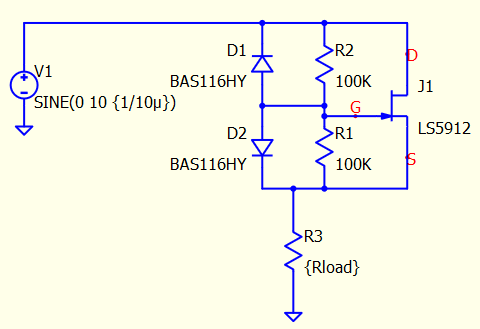
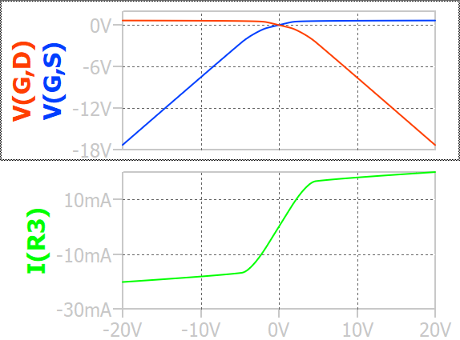
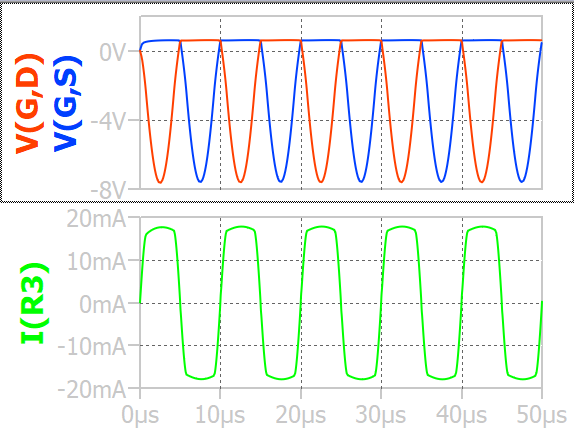

# Bidirectional current limiter

## JFET characteristics

JFET has near symmetrical structure, and the doping profiles are usually symmetrical, which makes its drain and source almost interchangeable. Because of the behaviour, many JFET define $V_{DG}$ and $V_{GS}$ max ratings, but will not define $V_{DS}$ max rating. 

The minor difference lies at that many JFET devices has smaller Cgd than Cgs to optimize the performance, especially for that used in high frequency application. 

The single-switch bidirectional current limiter utilizes the symmetry characteristic. 

## Bidirectional current limiter

A simple one JFET bidirectional current limiter circuit is shown below. 

- When with positive supply, Vgs is clampped to 0.7V when Vin is sufficiently high. This clamps JFET current near Idss.
- When with negative supply, Vgd clamped to 0.7V when Vin is sufficiently high. This clamps JFET current near -Idss.

When supply voltage sweeping from -20V to 20V, either Vgd or Vgs is clamped to 0.7V when the corresponding diode is forward biased. 

The transient simulation below shows how the current limiter works when supply voltage is too high. 

