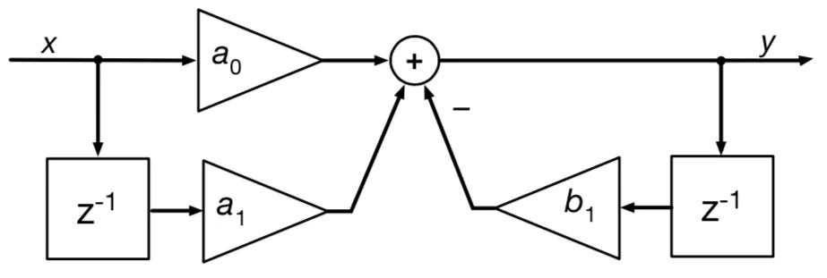

# Discretization

## $s$ to $z$ mapping functions

$$
F(s)=F(z)|_{z=e^{sT}}\quad \Longrightarrow \quad \left\{ \begin{align}z&=e^{sT}\\
s &=\dfrac{1}{T}\ln(z)\end{align}\right.
$$

With Taylor Expansion around $s_0=0$ and $z_0=1$, 
$$
\left\{
\begin{align}
z &= e^{sT} &&= 1+ \dfrac{sT}{1!} + \dfrac{(sT)^2}{2!} + \cdots &&= \sum_{k=0}^{\infty}\dfrac{(sT)^k}{k!} \\
s &= \dfrac{1}{T}\ln(z) &&= \dfrac{2}{T}\left\{\dfrac{z-1}{z+1} + \dfrac{1}{3}\left(\dfrac{z-1}{z+1}\right)^3 + \cdots \right\} &&= \dfrac{2}{T} \sum_{k+1}^{\infty}\dfrac{1}{2k-1}\left(\dfrac{z-1}{z+1}\right)^{2k-1}
\end{align}
\right.
$$

### Interpretation of the variable$z$ and  $z^{-1}$

From Laplace time-shift property, $z=e^{sT}$ is the time advance by $T$ second. $z^{-1}=e^{-sT}$ corresponds to unit sample period delay.

The Z-transform is the discrete-time counter-part of the Laplace transform. It is essential tool for the analysis and design of discrete-time systems. 

## Discretization methods

- Zero Order Hold (ZOH) method
- Tustin's method (bilinear transform method)
- Tustin’s method with frequency prewarping, or bilinear transformation

### Forward Euler / Forward Difference / Forward Rectangular

Taylor series expansion for $y(t)$ around $t_0$ is,  
$$
y(t_{0}+T)=y(t_{0})+Ty'(t_{0})+{\tfrac {1}{2}}T^{2}y''(t_{0})+O\left(T^{3}\right)
$$
Take the first order approximation, in time domain,
$$
y'(t_{0})\approx {\frac {y(t_{0}+T)-y(t_{0})}{T}}
$$

In Frequency domain, 
$$
s \leftarrow \dfrac{z-1}{T}
$$

$$
H_d(z) = H_a(s)|_{s=\frac{z-1}{T}}
$$

### Backward Euler / Backward Difference / Backward Rectangular

In time domain, 
$$
y'(t_{0})\approx {\frac {y(t_{0})-y(t_{0}-T)}{T}}
$$
In frequency domain, 
$$
s \leftarrow \dfrac{z-1}{Tz}
$$

$$
H_d(z) = H_a(s)|_{s=\frac{z-1}{Tz}}
$$

### Tustin's Method / Bilinear / Trapezoidal

The bilinear transform is a first-order [Padé approximant](https://en.wikipedia.org/wiki/Padé_approximant) of the natural logarithm function that is an exact mapping of the *z*-plane to the *s*-plane.
$$
z = e^{sT} = {\frac {e^{sT/2}}{e^{-sT/2}}} \approx {\frac {1+sT/2}{1-sT/2}}
$$
The inverse of the mapping is, 
$$
s\leftarrow {\frac {2}{T}}{\frac {z-1}{z+1}}
$$

$$
H_{d}(z)=H_{a}(s){\bigg |}_{s={\frac {2}{T}}{\frac {z-1}{z+1}}}=H_{a}\left({\frac {2}{T}}{\frac {z-1}{z+1}}\right)
$$

### Tustin's Method with Pre-warping

With bilinear transform the discrete and analog signal has frequency non-linear relationship of,
$$
{\displaystyle \omega _{a}={\frac {2}{T}}\tan \left(\omega _{d}{\frac {T}{2}}\right)}
$$
This effect is called [frequency warping](https://en.wikipedia.org/wiki/Bilinear_transform#Frequency_warping). For low frequency (${\displaystyle \omega _{d}\ll 2/T}$), ${\displaystyle \omega _{d}\approx \omega _{a}}$.

The continuous-time filter can be designed to compensate for this frequency warping by setting ${\displaystyle \omega _{a}={\frac {2}{T}}\tan \left(\omega _{d}{\frac {T}{2}}\right)}$, it's called **pre-warping** filter design.

To compensate for the frequency warping by pre-warping a frequency specification $\omega _{0}$, usually a resonant frequency or the frequency of the most significant feature of the frequency response.
$$
{\displaystyle s\leftarrow {\frac {\omega _{0}}{\tan \left({\frac {\omega _{0}T}{2}}\right)}}{\frac {z-1}{z+1}}}
$$

## First order filter

Analog first order filter is,
$$
H_a(s) =\frac{y(s)}{u(s)} = \frac{\omega_c}{s + \omega_c} = \frac{1}{1 + s/\omega_c} = \frac{1}{1+s T_f}
$$
$\omega_c$ is the bandwidth. $T_f$ is the filter constant. 

### First order filter - using forward difference method

Apply the forward difference method, 
$$
H_d(z) = \dfrac{1}{1+T_f \cdot \dfrac{z-1}{T_s}} = \dfrac{z^{-1}}{z^{-1} + \dfrac{T_f}{T_s}\left(1-z^{-1}\right)}
$$

$$
\dfrac{T_f}{T_s} y(k) = \dfrac{T_f - T_s}{T_s} y(k-1)+x(k-1)
$$

The current sampling data $x(k)$ is not used which is not reasonable. The forward difference method is rarely used. 

### First order filter - using backward difference method

Apply the backward difference method,
$$
H_d(z) = \dfrac{1}{1+T_f \cdot \dfrac{z-1}{T_s z}} = \dfrac{1}{1+\dfrac{T_f}{T_s}\left(1-z^{-1}\right)}
$$

$$
y(k)\cdot\left(1+\dfrac{T_f}{T_s}\right) = \dfrac{T_f}{T_s}y(k-1) + x(k)
$$

$$
y(k) = \dfrac{T_f}{T_f+T_s} y(k-1) + \dfrac{T_s}{T_f+T_s} x(k)
$$

usually $T_s \leq \dfrac{T_f}{5}$ to guarantee that the discrete filter performs similar to the analog counterpart. 

This filter is denoted the **exponentially weighted moving average (EWMA) filter**.

### First order filter - using Tustin's method

$$
H_d(z) = \dfrac{1}{1+T_f \cdot {\frac {2}{T_s}}{\frac {z-1}{z+1}}}
=\dfrac{1+z^{-1}}{1 + z^{-1} + \dfrac{2T_f}{T_s}(1-z^{-1})}
$$

$$
\left(1+\dfrac{2T_f}{T_s}\right)y(k) = \left(\dfrac{2T_f}{T_s} - 1\right) y(k-1) + x(k) + x(k-1)
$$

$$
y(k) = \dfrac{2T_f - Ts}{2T_f + T_s} y(k-1) + \dfrac{T_s}{2T_f + T_s}\left( x(k) + x(k-1) \right)
$$

## IIR vs. FIR filters

REF: [Difference between IIR and FIR filters: a practical design guide](https://www.advsolned.com/difference-between-iir-and-fir-filters-a-practical-design-guide/)

IIR filter is categorized by its theoretically infinite impulse response. 
$$
y(n)=\sum_{k=0}^{\infty}h(k)x(n-k)
$$
and an FIR categorized by its finite impulse response,
$$
y(n)=\sum_{k=0}^{N-1}h(k)x(n-k)
$$
Practically speaking, it is not possible to compute the output of an IIR using this equation. The equation may be re-written in terms of a finite number of poles $p$ and zeros $q$, 
$$
y(n)=\sum_{k=0}^{q}b_k x(n-k)-\sum_{k=1}^{p}a_ky(n-k)
$$
where, $a_k$ and $b_k$ are the filter’s denominator and numerator polynomial coefficients, who’s roots are equal to the filter’s **poles** and **zeros** respectively.
$$
\sum_{k=0}^{q}b_kx(n-k)-\sum_{k=1}^{p}a_ky(n-k)\quad\stackrel{\displaystyle\mathcal{Z}}{\longleftrightarrow}\quad\frac{\sum\limits_{k=0}^q b_kz^{-k}}{1+\sum\limits_{k=1}^p a_kz^{-k}}
$$

### First order IIR low-pass filter 

The general first order IIR digital formula is, 
$$
y(k) = b_1 y(k-1) + a_0 x(k) + a_1 x(k-1)
$$

### Biquad IIR low-pass filter

[wiki: Digital biquad filter](https://en.wikipedia.org/wiki/Digital_biquad_filter)

A digital Biquad filter is the ratio of two quadratic functions.
$$
{\displaystyle \ H(z)={\frac {b_{0}+b_{1}z^{-1}+b_{2}z^{-2}}{a_{0}+a_{1}z^{-1}+a_{2}z^{-2}}}}
$$
The coefficients are often normalized such that $a_0 = 1$:
$$
{\displaystyle \ H(z)={\frac {b_{0}+b_{1}z^{-1}+b_{2}z^{-2}}{1+a_{1}z^{-1}+a_{2}z^{-2}}}}
$$

